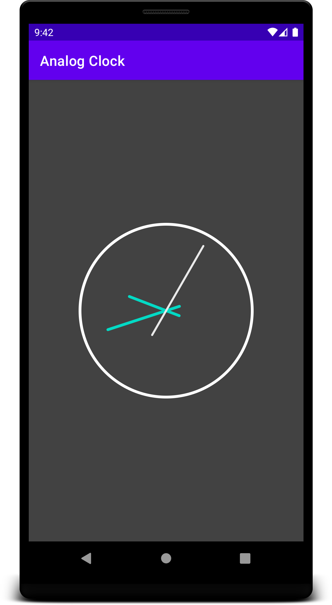

# AnalogClock
Simple implementation of an AnalogClock.
The core implementation is platform agnostic, so the code could
basically run with a Swing implementation too.

So, if you feel lucky, just go ahead and fork it ;)

### Screenshot

